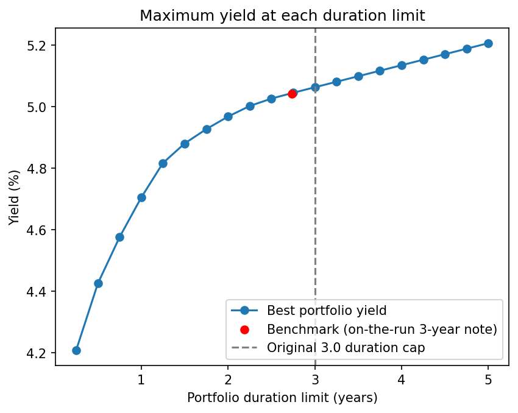

# US Treasury Portfolio Construction: Duration-Matched Yield Optimization

**Objective:** Determine whether an optimized portfolio of US Treasuries can deliver a meaningful yield pickup over the on-the-run 3-year note at the same modified duration.

**Conclusion:** As of September 29, 2026, the duration-matched optimized portfolio offered only 0.3 bps of yield pickup over the on-the-run 3-year note. In the current rising-rate environment, extending duration for extra yield was also poorly compensated.

## Findings

**1. Duration-matched, the optimized portfolio offers no meaningful pickup.**

As of September 29, 2026, there was not much of an incentive to buy and hold a portfolio of US Treasuries rather than buy and hold a single 3-year benchmark note of the same duration: the optimized portfolio yielded only 0.3 bps more, about $3 a year per $100,000.

| | On-the-run 3-year note | Optimized portfolio |
|---|---|---|
| YTM | 5.041% | 5.044% |
| Modified duration | 2.735 | 2.735 |
| Yield pickup | | 0.3 bps |

**2. Extending duration is poorly compensated.**

| Duration constraint | Incremental yield per year of duration |
|---|---|
| 2.75 to 5.0 | ~7 bps |

Each additional year of duration adds ~7 bps of yield against ~100 bps of price sensitivity per 100 bp parallel shift. Over a one-year horizon, a ~7 bp rise in yields would cause a price loss that fully offsets the additional ~7 bps of yield (the breakeven). Given the hawkish policy backdrop (a 25 bp FOMC hike on September 16, 2026, with further tightening signaled), the risk/reward favors staying at benchmark duration.

## Methodology

- **Universe:** US Treasury bills, notes and bonds, excluding TIPS and FRNs. Liquidity screen: bid-ask spread of 5 cents per $100 or less. 323 securities.
- **Benchmark:** on-the-run 3-year note, CUSIP 91282CRL7 (4.375%, Sep 15, 2029).
- **Analytics:** YTM (semi-annual compounding) and modified duration from each security's cash flows, priced at the dirty price (offer plus accrued interest). Benchmark YTM validated against Treasury's published 3-year par yield (6 bps difference).
- **Optimization:** linear program maximizing portfolio YTM, subject to full investment, long-only, and portfolio duration ≤ benchmark duration.

Full methodology, validation and trade list are in the notebook.

## Data

US Treasury sources:
- [FedInvest price report](https://www.treasurydirect.gov/GA-FI/FedInvest/selectSecurityPriceDate): end-of-day bid and offer prices, all marketable Treasuries
- [Fiscal Data API](https://fiscaldata.treasury.gov/): auction data, used to identify the on-the-run 3-year note
- [Daily Treasury Par Yield Curve Rates](https://home.treasury.gov/resource-center/data-chart-center/interest-rates/TextView?type=daily_treasury_yield_curve&field_tdr_date_value=2026): benchmark validation

## Limitations

- Single-date cross-section; results are price-date dependent.
- FedInvest prices are end-of-day indicative, not executable quotes.
- YTM is realized only if held to maturity; long-dated holdings carry mark-to-market risk over shorter horizons.
- Portfolio YTM approximated as the market-value-weighted average of constituent YTMs.

*Built in Python (Google Colab).*
